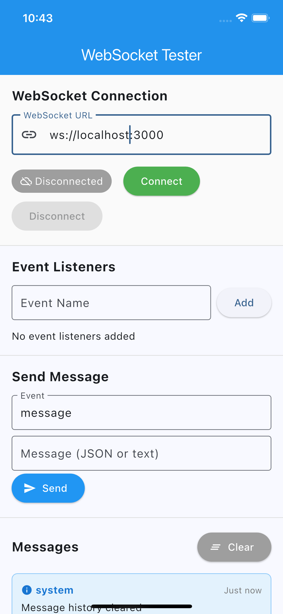

# Socketation - WebSocket Testing Tool

<div align="center">


A powerful, user-friendly WebSocket testing application built with Flutter and Socket.IO client. Test WebSocket connections, manage event listeners, and monitor real-time communication with an intuitive interface.

[Features](#features) • [Installation](#installation) • [Usage](#usage) • [Architecture](#architecture) • [Contributing](#contributing)

</div>

## 🚀 Features

### Core Functionality
- **🔗 WebSocket Connection Management**: Connect to any Socket.IO server with real-time status indicators
- **📡 Custom Event Listeners**: Add, remove, and toggle custom event listeners dynamically
- **💬 Real-time Messaging**: Send and receive messages with JSON or plain text support
- **📊 Message History**: Complete message history with timestamps and direction indicators
- **🎛️ Manual Control**: Dedicated connect and disconnect buttons for full control

### Advanced Features
- **🔄 Connection Status Tracking**: Visual indicators for all connection states (Disconnected, Connecting, Connected, Error, Reconnecting)
- **🎯 Event Management**: Pre-configured listeners for common Socket.IO events (connect, disconnect, error, message, notification)
- **📝 Error Handling**: All connection errors and debug information displayed in the UI instead of console
- **🧹 Message Management**: Clear message history and auto-scroll to latest messages
- **⚡ No Auto-Disconnect**: Maintains connection attempts even on errors for better testing control

## 📱 Screenshots

<div align="center">

### Main Interface

*Clean, intuitive interface for WebSocket testing with connection controls, event management, and real-time messaging*

</div>


## 🛠️ Installation

### Prerequisites
- Flutter SDK (>=3.8.1)
- Dart SDK
- Android Studio / VS Code with Flutter extensions

### Setup
1. **Clone the repository**
   ```bash
   git clone https://github.com/yourusername/socketation.git
   cd socketation
   ```

2. **Install dependencies**
   ```bash
   flutter pub get
   ```

3. **Run the application**
   ```bash
   flutter run
   ```

### Dependencies
```yaml
dependencies:
  flutter:
    sdk: flutter
  get: ^4.6.6                    # State management
  socket_io_client: ^3.1.2       # WebSocket client
  cupertino_icons: ^1.0.8        # iOS-style icons
```

## 📖 Usage

### Quick Start
1. **Launch the app** and enter your WebSocket server URL (e.g., `http://localhost:3000`)
2. **Click Connect** to establish connection
3. **Add custom event listeners** by typing event names and clicking "Add"
4. **Send messages** by entering an event name and message content (JSON or text)
5. **Monitor real-time communication** in the messages section
6. **Use Disconnect** to terminate connections manually

### Example Usage Scenarios

#### Testing a Local Socket.IO Server
```bash
# Start a local Socket.IO server (example using Node.js)
npm install socket.io
node server.js  # Your Socket.IO server on port 3000
```

Then in Socketation:
- URL: `http://localhost:3000`
- Add listeners: `chat_message`, `user_joined`, `notification`
- Send test messages with custom events

#### Testing Remote WebSocket APIs
- URL: `wss://your-websocket-api.com`
- Add authentication events if needed
- Monitor API responses and error handling

## 🏗️ Architecture

This project follows a clean, modular architecture using **GetX** for state management and **Socket.IO Client** for WebSocket communication.

### Project Structure
```
lib/
├── main.dart                           # App entry point
├── controllers/
│   └── websocket_controller.dart       # State management & business logic
├── services/
│   └── websocket_services.dart         # Socket.IO communication layer
├── models/
│   ├── connection_status_model.dart    # Connection state enum
│   ├── websocket_message_model.dart    # Message data structure
│   └── websocket_event_listener_model.dart # Event listener data
└── views/
    └── websocket_testing_view.dart     # UI components
```

### Architecture Layers

#### 🎮 **Controllers** (Business Logic)
- **`WebsocketController`**: Manages all WebSocket state using GetX reactive variables
- Handles user interactions, validation, and error management
- Coordinates between services and UI updates

#### 🌐 **Services** (Network Layer)
- **`WebsocketServices`**: Wraps Socket.IO client functionality
- Manages connections, event listeners, and message sending
- Provides callbacks for UI updates without console logging

#### 📋 **Models** (Data Layer)
- **Immutable data structures** with JSON serialization
- **Well-documented** with comprehensive type safety
- **Reactive-friendly** for GetX state management

#### 🖼️ **Views** (Presentation Layer)
- **Logic-free UI components** using reactive GetX patterns
- **Responsive design** with clear visual indicators
- **Accessibility-ready** with proper semantics

### Key Design Patterns
- **GetX Reactive Programming**: `.obs` variables for automatic UI updates
- **Dependency Injection**: `Get.put()` for controller management
- **Callback Architecture**: Services communicate with controllers via callbacks
- **Immutable Models**: Consistent data structures with `copyWith()` methods

## 🧪 Testing WebSocket Servers

### Compatible Server Types
- ✅ **Socket.IO servers** (Node.js, Python, etc.)
- ✅ **Standard WebSocket servers** with Socket.IO protocol
- ✅ **Local development servers**
- ✅ **Remote production APIs**
- ✅ **WSS (secure WebSocket) connections**

### Example Server URLs
```
# Local development
http://localhost:3000
ws://localhost:8080

# Remote servers
https://your-socketio-server.com
wss://secure-websocket-api.com

# Testing services
wss://echo.websocket.org
```

## 🔧 Development

### Running in Development Mode
```bash
# Hot reload development
flutter run

# Run with verbose logging
flutter run -v

# Run on specific device
flutter devices
flutter run -d <device_id>
```

### Building for Production
```bash
# Android APK
flutter build apk --release

# iOS (requires macOS and Xcode)
flutter build ios --release

# Web
flutter build web
```

## 🤝 Contributing

Contributions are welcome! Please follow these steps:

1. **Fork the repository**
2. **Create a feature branch**: `git checkout -b feature/amazing-feature`
3. **Follow the coding standards**:
   - Use `snake_case.dart` for files
   - Use `PascalCase` for classes
   - Use `camelCase` for functions and variables
   - Add `///` documentation for all public methods
4. **Commit your changes**: `git commit -m 'Add amazing feature'`
5. **Push to the branch**: `git push origin feature/amazing-feature`
6. **Open a Pull Request**

### Code Style Guidelines
- Follow the existing GetX + Services architecture
- No business logic in UI widgets
- Use reactive programming patterns (`Rx` variables)
- Add comprehensive documentation
- Handle errors gracefully with user-friendly messages

## 📋 TODO / Roadmap

- [ ] Add authentication support for secured WebSocket connections
- [ ] Implement message filtering and search functionality
- [ ] Add export/import for connection profiles
- [ ] Support for WebSocket subprotocols
- [ ] Dark mode theme support
- [ ] Message persistence across app restarts
- [ ] Connection history and favorites
- [ ] Performance metrics and connection statistics

## 🐛 Known Issues

- None currently reported. Please [create an issue](https://github.com/yourusername/socketation/issues) if you find any bugs.

## 📄 License

This project is licensed under the MIT License - see the [LICENSE](LICENSE) file for details.

## 🙏 Acknowledgments

- [Socket.IO](https://socket.io/) for the excellent WebSocket implementation
- [GetX](https://pub.dev/packages/get) for reactive state management
- [Flutter](https://flutter.dev/) for the amazing cross-platform framework

## 📞 Support

If you have any questions or need help:

- 📧 **Email**: info@ibrahimmakary.dev
- 🐛 **Issues**: [GitHub Issues](https://github.com/Ibrahimmakary/socketation/issues)
- 💬 **Discussions**: [GitHub Discussions](https://github.com/Ibrahimmakary/socketation/discussions)

---

<div align="center">

**Made with ❤️ using Flutter**

⭐ Star this repo if you found it helpful!

</div>
